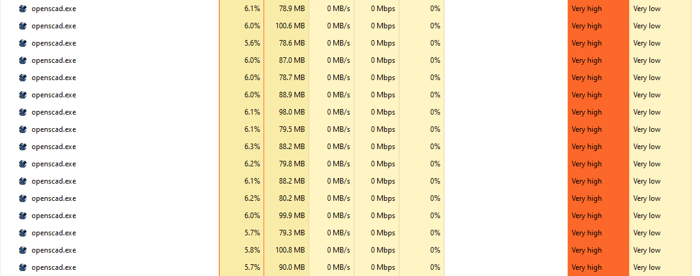

# Threaded OpenSCAD rendering with Python3

While rendering several, highly complex modules in OpenSCAD, I found the limit of one CPU thread to be not enough.

I wrote something in bash that makes use of ```&``` and decided to take it further to do it with organised threading and queueing in Python.

This code __does not__ make single operations faster, it only parralellises single operations and runs them simultaneously. If you've got a single model being rendered, it __will not__ make anything faster.

By default, the code looks at your CPU and determines how many threads to run based on that. You can customise this to use more or less threads but keep in mind that as these threads run at a fairly high priority so having more threads than cpu cores is going to be slower.

## What it does

1. In auto-mode (which is default), this script extracts which models you specify to be rendered and builds up a list called `models` including the output format of `stl`, `svg`, or `dxf`
2. In config mode this script loads the `render_config.yaml` file that has core config values and a list of names of modules and output formats
3. For each entry in the `models` list in the config the code generates a temporary scad file that sets a variable `batch_rendering` to true
4. For each temporary scad file it runs a subprocess thread that renders and pipes the output to a file in the `output` directory
5. It deletes the temporary scad files
6. Finally the script reports the runtime

## Using it in your projects

These instructions assume you have a single OpenSCAD file or a single entrypoint, it also assumes that you have a check that renders mothing in your code if the `batch_rendering` variable exists (there's an example of this check below).

### Auto mode

As of 2025-02-15, the default is an auto-mode, this mode uses comments as decorators, these are very specific and they're easy to mis-type!

Anywhere in the scad file, you can configure the render quality and the number of threads by adding the following comments and changing the value between the square braces `[]` - if you don't have these comments, it will default to 95 and the number CPUs in your machine by default:

```c++
//render.quality [85]
//render.number_of_threads [36]
```

Defining modules to render - each module that you want to render only needs to have an output type specified, there are no defaults, if there's no comment, it will not be exported.

You can choose `stl`, `svg` or `dxf` like this:

```c++
module mycool_model_for_stl() '//render.model.stl'
{ }
module mycool_model_for_svg() '//render.model.svg'
{ }
module mycool_model_for_dxf() '//render.model.dxf'
{ }
```

### Config file mode

You will need to:

1. create `render_config.yaml` in the same folder as your entrypoint OpenSCAD using the example code block
2. Use the workspace example below
3. Put the renderer.py into your `$PATH` or refer to it's full path

__Note:__ In this mode, the suffix value can be anything understandable by OpenSCAD.

Once you have all this above you just need to execute the renderer.py script while you're in your project directory.

### The `render_config.yml` file format

Only the models list is necessary in here

```YAML
scad_file: mycoolfile.scad
#threads: 16 # defaults to all cores
#quality: 95 # default 95
models:
  - module: "easy_render_5_for_dxf" # name of the openscad function to run
    suffix: "dxf" # Suffix is needed if you don't want an STL
  - module: "easy_render_4" # had no suffix so defaults to STL
```

## Example project scad file

```c++
/** working output code **/
if (is_undef(batch_rendering)) {
  $fn = 40; // the FN for your prototyping

  // your prototyping modules here

}

// your module code here

module mycool_model_for_stl() //render.model.stl
{ }
module mycool_model_for_svg() //render.model.svg
{ }
module mycool_model_for_dxf() //render.model.dxf
{ }

```

## Running the code

It's best to have this repository folder in the path to make things simpler, then run something similar to the below in your project directory:

```bash
# Runs with the default `project.scad` file in auto-mode
renderer.py

# Runs with a custom scad filename in auto-mode
renderer.py -f=custom.scad

# Runs with the default `project.scad` file in config-file mode with the default config file (render_config.yml)
renderer.py -a=False

# Runs with the default file name (project.scad)in config-file mode using a custom config filename
renderer.py -a=False -c=config.yaml

# Runs a custom scad filename in config-file mode using a custom config filename
renderer.py -a=False -f=custom.scad -c=config.yaml
```

## Running examples

The base code tests how fast this can process using 4 threads, execute the code with no changes to see how well it works with 4 threads.

Change the ```number_of_threads``` variable in the `yaml` file to see how well it does with 1,8,16,42,200 threads and, provided your OS is happy to do so and doesn't run out of resources, it will render simultaneously and thus make use of all those CPU cores you're not using.

## Some benchmarks

Benchmarked on a Windows 11 machine with:

* Intel Core i7 10700KF (8 core/16 thread) (3.8 GHz base, 4.8ghz boost)
* 32GB Ram
* PCI SSD's
* Python 3.9.7
* RTX3080
* OpenSCAD version 2021.05.26
* Not much else going on

I've configured a pretty brutal test, possibly introducing a variation thats way too high because the ```$fn = 90``` increases the amount of operations dramatically, still why not test a boat with a storm?

In my default file, I've disabled rendering jobs for the really complex modules because they weren't demonstrating anything new, feel free to enable them.

Threaded stats here:

| Threads | Render time | Notes |
| ------- | ----------- | ------ |
| 1 | 4:54 | Comparable to the GUI - computer didn't notice |
| 2 | 2:35 | again Comparable to the GUI - computer didn't notice |
| 8 | 1:17 | the total time for all 16 models was 1 second longer than the longest build  |

As to be expected; my CPU does a better job at rendering 8 things at a time than it would trying to do 1 things at a time.

This is what it looks like:



If you manage to render more models at once than you have threads, the CPU will start scheduling hard, so more threads than you have means less productivity.

By default the script will use a thread per registered CPU - which is one per hyper-thread - up until it runs out of models to render.

## Requirements

* Python 3.6+
* OpenSCAD
* Windows/MacOS/Linux environment

This was built with Python3.6 installed using pyenv, I'm no python master, this is not tricky.

## Credits

Dan Kirshner.

In the interests of making hard-to-render workloads I've used the thread module file from [openscad-threads](http://dkprojects.net/openscad-threads/) its fantastic!

I've modified it so it doesn't limit the ```$fn``` variable because while this is very useful in normal use, I don't want to reduce the load in this case.

## Licence

```text
/* 
 * — — — — — — — — — — — — — — — — — — — — — — — — — — — — — — — — — 
 * “THE BEER-WARE LICENSE” (Revision 42):
 * <spidey> wrote this file. As long as you retain this  
 * notice you can do whatever you want with this stuff. If we meet
 * some day, and you think this stuff is worth it, you can buy me
 * a beer in return.
 * — — — — — — — — — — — — — — — — — — — — — — — — — — — — — — — — — 
 * Amendment 1: The author(s) of this code accept absolutely no 
 * liability for any damage or general bad things that may come as 
 * part of its use. Any use of this software is deemed an agreement 
 * to absolve the author(s) of any liability, culpability, 
 * durability and any other “(*)ability” (good or bad).
 */
 ```
